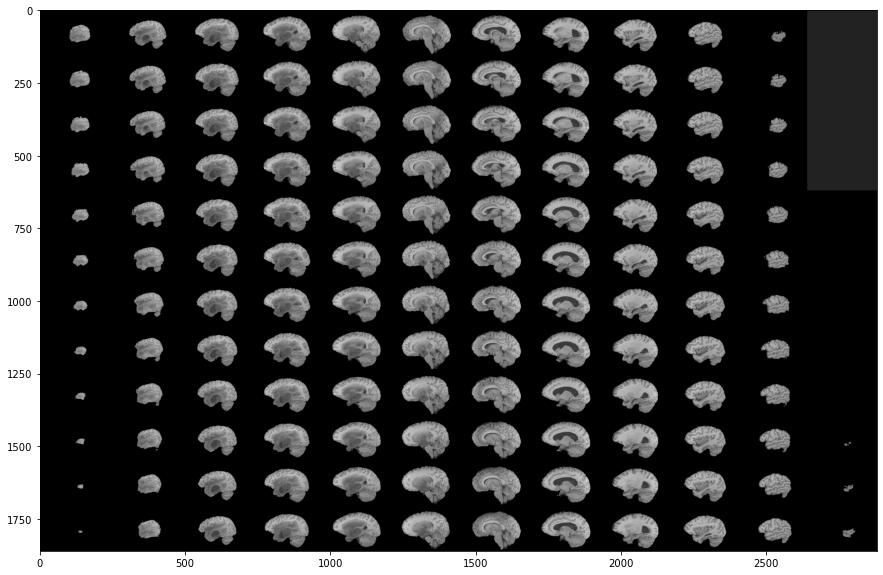
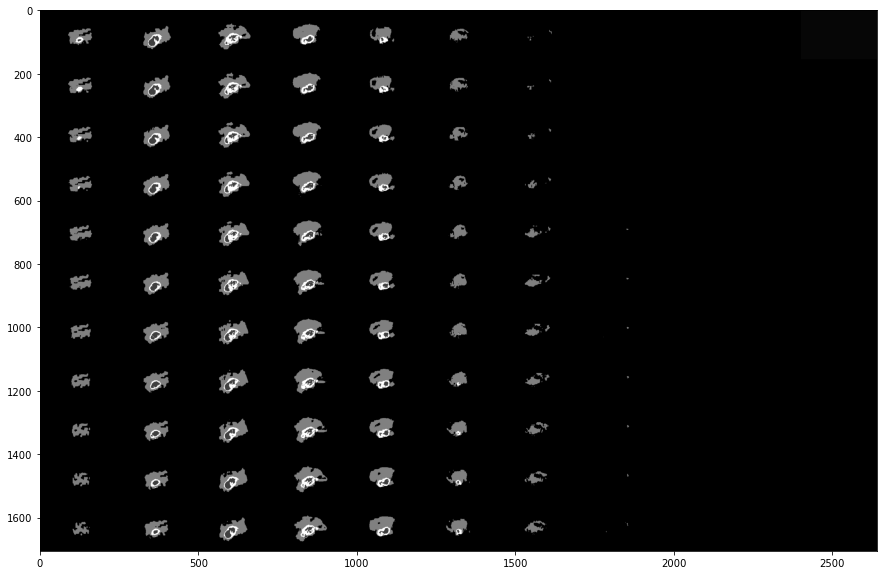
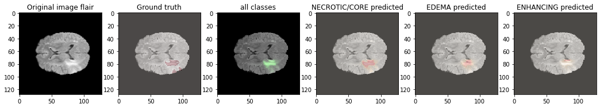

# 🧠 Brain Tumor Segmentation using U-Net on BraTS MRI Dataset

Deep Learning based semantic segmentation of brain tumors from multi-modal MRI scans using a U-Net architecture.

---

## Project Overview

Brain tumor segmentation is one of the most important tasks in medical image analysis. Manual delineation of tumors is time-consuming and depends heavily on radiologists.

This project implements a **U-Net based semantic segmentation model** to automatically identify tumor regions from MRI scans using the **BraTS dataset**.

The model learns pixel-wise classification of MRI slices into multiple tumor regions and background.

---

## Features

✔ MRI preprocessing

✔ Multi-modal MRI visualization

✔ Brain Tumor Segmentation

✔ U-Net implementation from scratch

✔ Dice Loss

✔ Mean IoU Metric

✔ Data Generator for large datasets

✔ Model Training

✔ Model Evaluation

✔ Visualization of predictions

---

# Dataset

The project uses the **BraTS (Brain Tumor Segmentation Challenge)** dataset.

MRI Modalities:

- T1
- T1CE
- T2
- FLAIR

Segmentation Labels:

| Label | Region |
|--------|---------|
| 0 | Background |
| 1 | Necrotic / Non-enhancing Tumor |
| 2 | Edema |
| 4 | Enhancing Tumor |

Each MRI scan is stored in **NIfTI (.nii.gz)** format.

---

# Sample MRI Images

<p align="center">

</p>

---

# Tumor Segmentation Labels

<p align="center">

</p>

---

# Data Pipeline

MRI Scan (.nii.gz)

↓

Read NIfTI files

↓

Normalize Images

↓

Create Masks

↓

Resize

↓

Data Generator

↓

U-Net

↓

Prediction

---

# Model Architecture

This project implements a U-Net architecture consisting of:

Encoder

- Conv Block
- Max Pooling

Bottleneck

Decoder

- UpSampling
- Skip Connections
- Convolution Blocks

Final Layer

- Softmax activation
- Multi-class segmentation

<p align="center">

</p>

---

# Loss Function

Dice Loss

Dice coefficient measures overlap between prediction and ground truth.

It is particularly effective for medical image segmentation because of class imbalance.

---

# Evaluation Metrics

The model is evaluated using:

- Dice Coefficient
- Mean IoU
- Accuracy
- Precision
- Sensitivity (Recall)

---

# Training

The notebook uses:

- TensorFlow
- Keras
- Custom Data Generator
- Model Checkpoint
- Early Stopping
- ReduceLROnPlateau

---

# Results

The pretrained model achieved approximately:

| Metric | Value |
|---------|--------|
| Mean IoU | **81%** |
| Dice Score | **65.5%** |
| Accuracy | ~81% |

> Values are obtained from the pretrained model included in the notebook.

---

# Training Curves

## Accuracy

<p align="center">

</p>

## Loss

<p align="center">

</p>

---

# Prediction Results

### Example 1

<p align="center">

</p>

---

### Example 2

<p align="center">

</p>

---

### Example 3

<p align="center">

</p>

---

# 3D Visualization

<p align="center">

</p>

---

# Tech Stack

- Python
- TensorFlow
- Keras
- NumPy
- OpenCV
- Matplotlib
- nibabel
- scikit-image

---

# Installation

```bash
git clone https://github.com/yourusername/Brain-Tumor-Segmentation-U-Net.git

cd Brain-Tumor-Segmentation-U-Net

pip install -r requirements.txt
```

---

# Run

```bash
jupyter notebook
```

Open

```
3d-mri-brain-tumor-segmentation-u-net.ipynb
```

---

# Repository Structure

```
Brain-Tumor-Segmentation-U-Net
│
├── README.md
├── requirements.txt
├── notebook.ipynb
├── images/
├── results/
```

---

# Future Improvements

- Attention U-Net
- UNet++
- DeepLabV3+
- 3D U-Net
- MONAI implementation
- Mixed Precision Training
- TensorBoard Integration

---

# References

- U-Net: Convolutional Networks for Biomedical Image Segmentation
- BraTS Challenge Dataset
- TensorFlow
- Keras

---

# Author

**Rahshana K**

B.Tech Computer Science and Business Systems

Interested in Medical AI • Computer Vision • Deep Learning • Generative AI