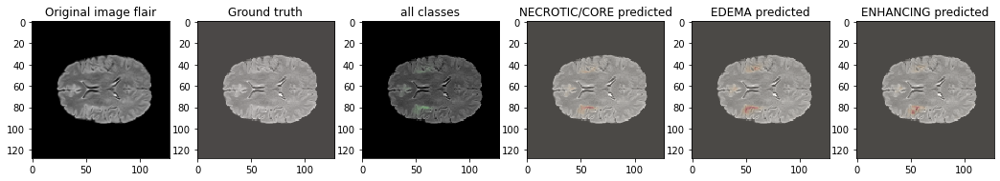
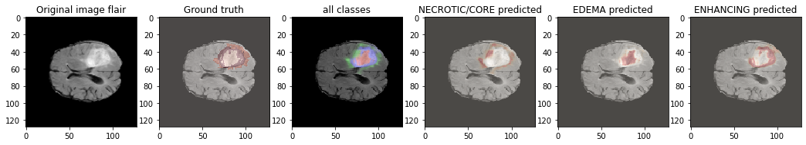
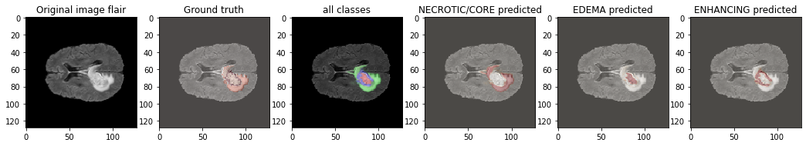

# 🧠 Brain Tumor Segmentation using U-Net (BraTS MRI Dataset)

Deep Learning based semantic segmentation of brain tumors from multi-modal MRI scans using a U-Net architecture.

---

## Project Overview

Brain tumor segmentation is one of the most important tasks in medical image analysis. Manual delineation of tumors is time-consuming and depends heavily on radiologists.

This project implements a **U-Net based semantic segmentation model** to automatically identify tumor regions from MRI scans using the **BraTS dataset**.

The model learns pixel-wise classification of MRI slices into multiple tumor regions and background.

---

## Features

 - MRI preprocessing
 - Multi-modal MRI visualization
 - Brain Tumor Segmentation
 - U-Net implementation from scratch
 - Dice Loss
 - Mean IoU Metric
 - Data Generator for large datasets
 - Model Training
 - Model Evaluation
 - Visualization of predictions


---

# Dataset

The project uses the **BraTS (Brain Tumor Segmentation Challenge)** dataset.

MRI Modalities:

- T1
- T1CE
- T2
- FLAIR

Segmentation Labels:

| Label | Region |
|--------|---------|
| 0 | Background |
| 1 | Necrotic / Non-enhancing Tumor |
| 2 | Edema |
| 4 | Enhancing Tumor |

Each MRI scan is stored in **NIfTI (.nii.gz)** format.

---

# Sample MRI Images


---

# Tumor Segmentations


---
# Model Architecture

This project implements a U-Net architecture consisting of:

Encoder

- Conv Block
- Max Pooling

Bottleneck

Decoder

- UpSampling
- Skip Connections
- Convolution Blocks

Final Layer

- Softmax activation
- Multi-class segmentation


---

# Data Pipeline


---

# Evaluation Metrics

The model is evaluated using:

- Dice Coefficient
- Mean IoU
- Accuracy
- Precision
- Sensitivity (Recall)

---

# Results

The pretrained model achieved approximately:

| Metric | Value |
|---------|--------|
| Mean IoU | **81%** |
| Dice Score | **65.5%** |
| Accuracy | ~81% |

---

# Training Curves

## Accuracy & Loss


---

# Prediction Results

### Example 1

<p align="center">

</p>

---

### Example 2

<p align="center">

</p>

---

### Example 3

<p align="center">

</p>

---

# 3D Visualization

<p align="center">

</p>

---

# Tech Stack

- Python
- TensorFlow
- Keras
- NumPy
- OpenCV
- Matplotlib
- nibabel
- scikit-image

---

# Repository Structure

```
Brain-Tumor-Segmentation-U-Net
│
├── README.md
├── requirements.txt
├── notebook.ipynb
├── images/
```

---

# Future Improvements

- Attention U-Net
- UNet++
- DeepLabV3+
- 3D U-Net
- MONAI implementation
- Mixed Precision Training
- TensorBoard Integration

---

# References

- U-Net: Convolutional Networks for Biomedical Image Segmentation
- BraTS Challenge Dataset
- TensorFlow
- Keras

---

# Author

**Rahshana K**

B.Tech Computer Science and Business Systems

Interested in Medical AI • Computer Vision • Deep Learning • Generative AI
